# ngrok-motor-service

Sistema multilenguaje para conexión de ESP32 a servidores con [ngrok](https://ngrok.com/)

## Requisitos

<details><summary><h3>VS Code</h3></summary>

[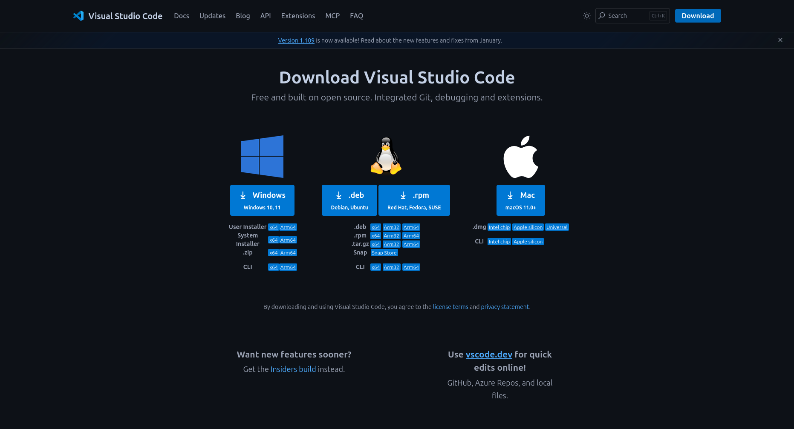](#)

[](https://code.visualstudio.com/download)

</details>


<details><summary><h3>Git</h3></summary>

[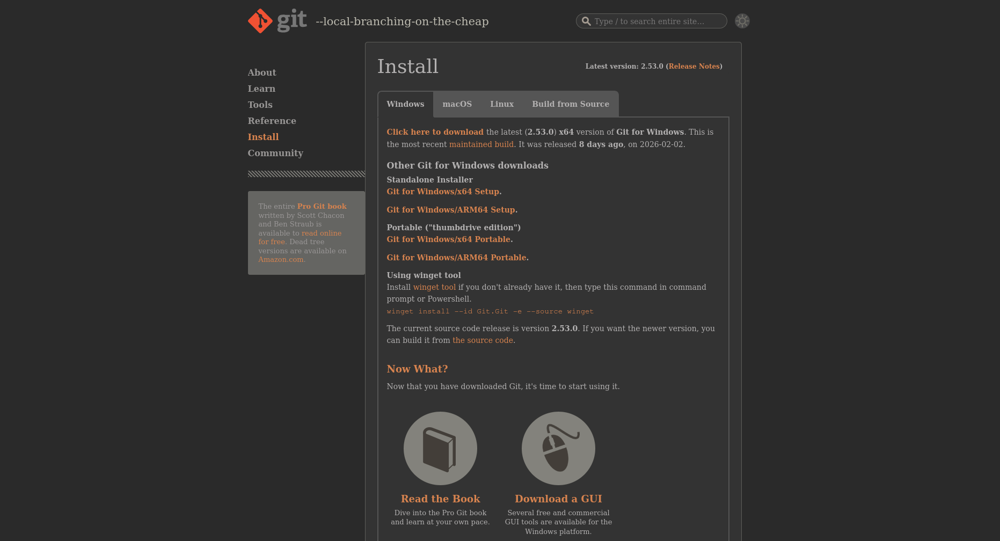](#)

[](https://github.com/git-for-windows/git/releases/download/v2.53.0.windows.1/Git-2.53.0-64-bit.exe)

</details>


<details><summary><h3>Node.js</h3></summary>

[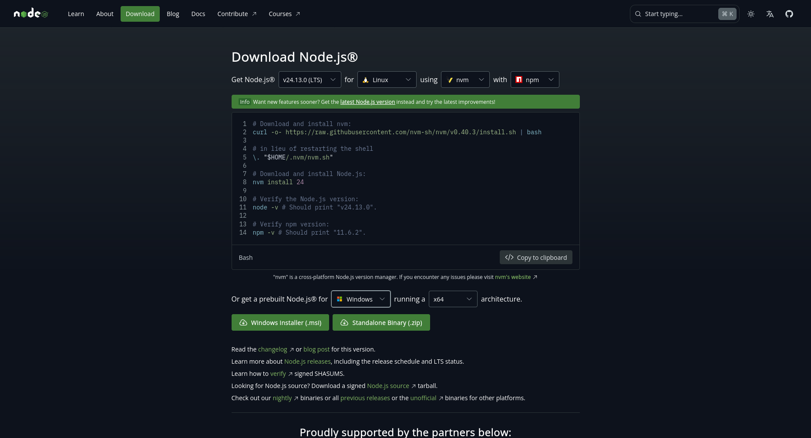](#)

[](https://nodejs.org/dist/v25.6.0/node-v25.6.0-x64.msi)

</details>


<details><summary><h3>Arduino</h3></summary>

[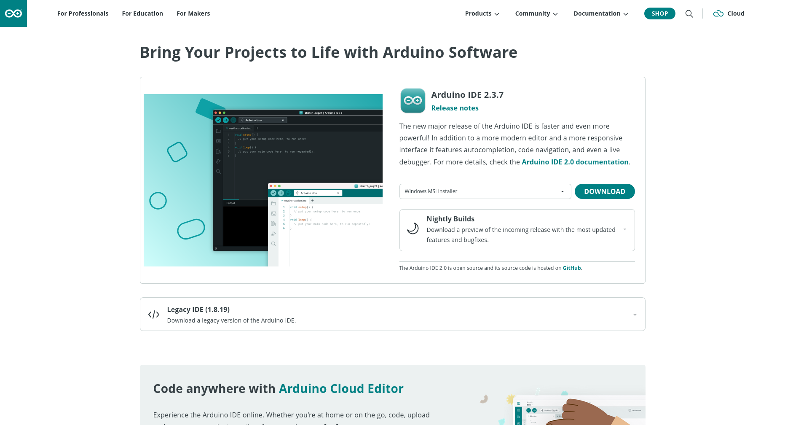](#)

[](https://downloads.arduino.cc/arduino-ide/arduino-ide_2.3.7_Windows_64bit.msi)

</details>


<details><summary><h3>Matlab</h3></summary>

[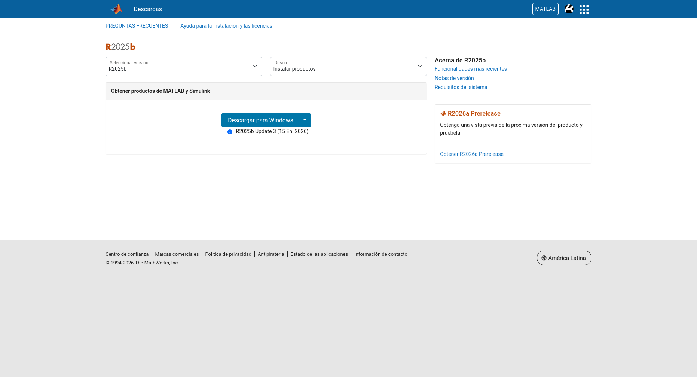](#)

[](https://la.mathworks.com/downloads/)

</details>

### Ngrok

|1. Crear una cuenta | 2. Localiza tu token personal | 3. Identifica tu dominio estatico |
|---|---|---|
| [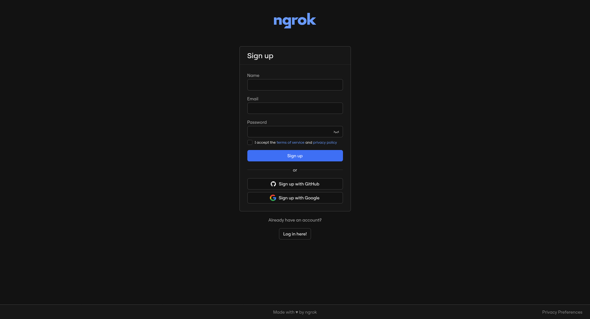](https://dashboard.ngrok.com/signup)| [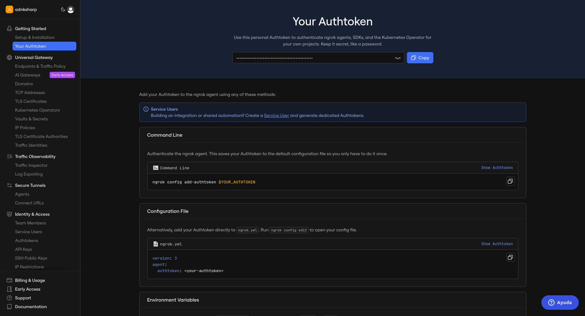](https://dashboard.ngrok.com/get-started/your-authtoken) | [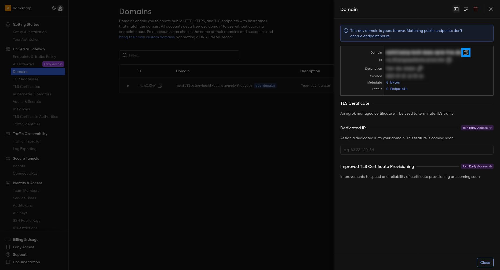](https://dashboard.ngrok.com/domains)

## Instalación

#### 1. Usando `git GUI` clona el repositorio 

```css
https://github.com/adnksharp/ngrok-motor-service.git
```

> [!TIP]
> Como recomendación elige una carpeta lo más cercana a `C:\`

[](#)
[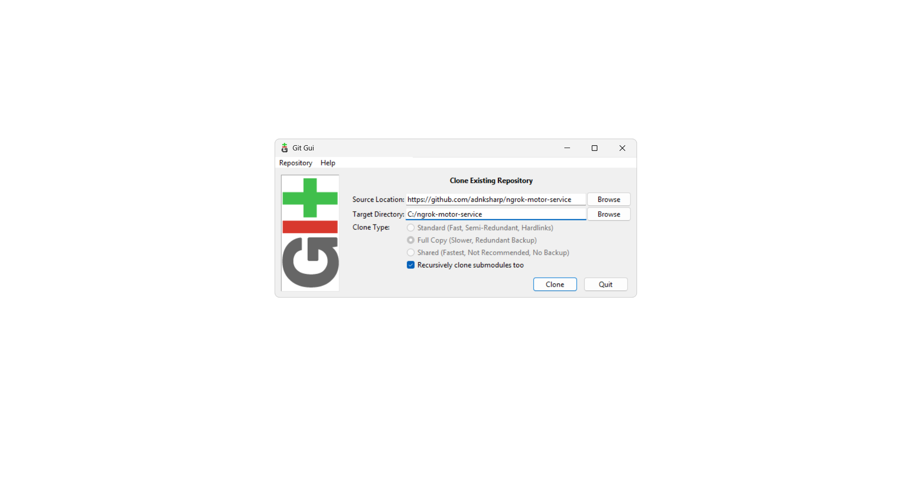](#)

#### 2. Desde VS-Code abre la carpeta donde clonaste el repositorio

[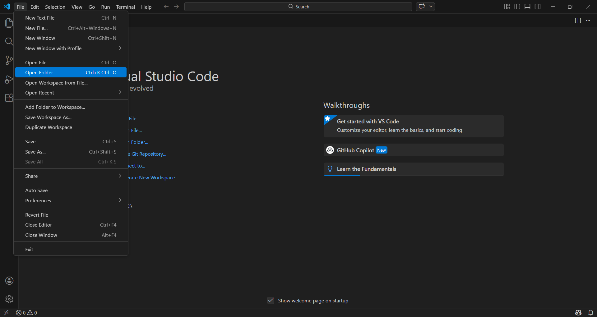](#)

#### 3. Desde el `command prompt` en la terminal instala las dependencias necesarias

```sh
npm i
```

[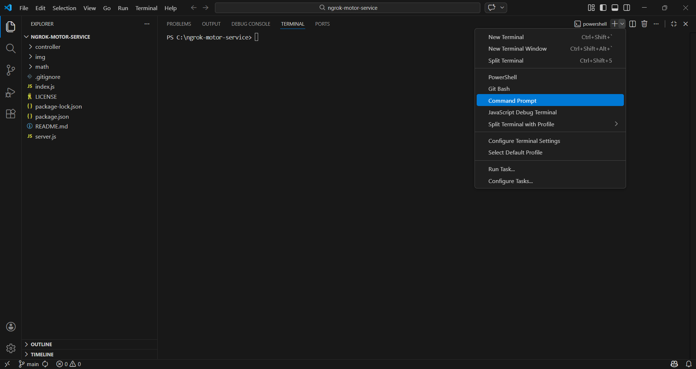](#)
[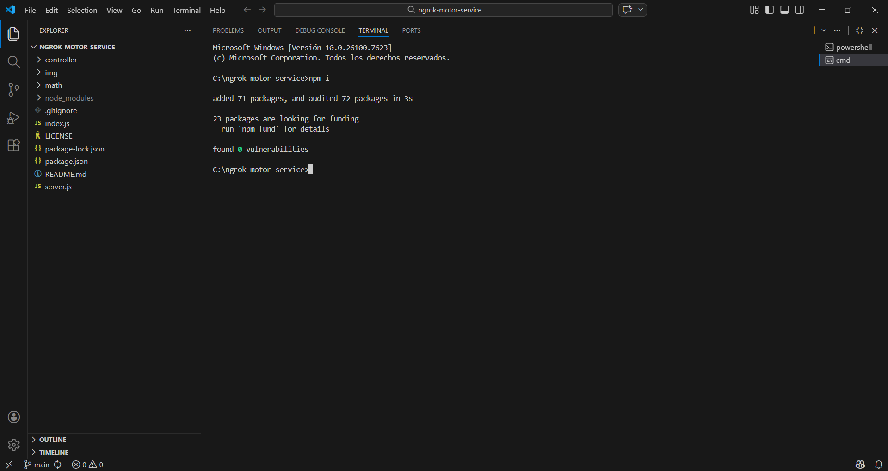](#)

## Configuración

> [!WARNING]
> Los pasos de esta sección se realizan una sola vez

### Servidor `@ngrok/ngrok`
En la ubicación raiz crea un nuevo archivo `.env` con el siguiente contenido:

```text
NGROK_AUTHTOKEN=tu-token-personal-de-ngrok
PORT=8000
NGROK_DOMAIN=tu-dominio-estatico-de-ngrok
```

### Variables de Matlab

#### 1. Crear el archivo de variables

Dentro de la carpeta `math` crea un archivo `env.m` con el siguiente contenido:

```matlab
NGROK_DOMAIN='https://tu-dominio-estatico-de-ngrok'

save('config.mat', 'NGROK_DOMAIN');
```

#### 2. Ejecutar el script
Al ejecutarlo desde matlab se creara un binario `config.mat` necesario para usar `get_request.m` y `post_request.m`

### Variables de arduino

En la carpeta `controller` crea un archivo `keys.h` con el siguiente contenido:

```cpp
const char* SSID = "Nombre-de-la-red-wifi";
const char* PASS = "Contraseña";

String server = "https://tu-dominio-estatico-de-ngrok";
```

La estructura de los archivos debe de quedar de la siguiente manera

```text
.
├── controller
│   ├── controller.ino
│   ├── keys.h
│   ├── web.cpp
│   └── web.h
├── math
│   ├── config.mat
│   ├── env.m
│   ├── get_request.m
│   ├── post_request.m
│   └── sample.m
├── .env
├── index.js
├── package.json
├── package-lock.json
└── server.js
```
